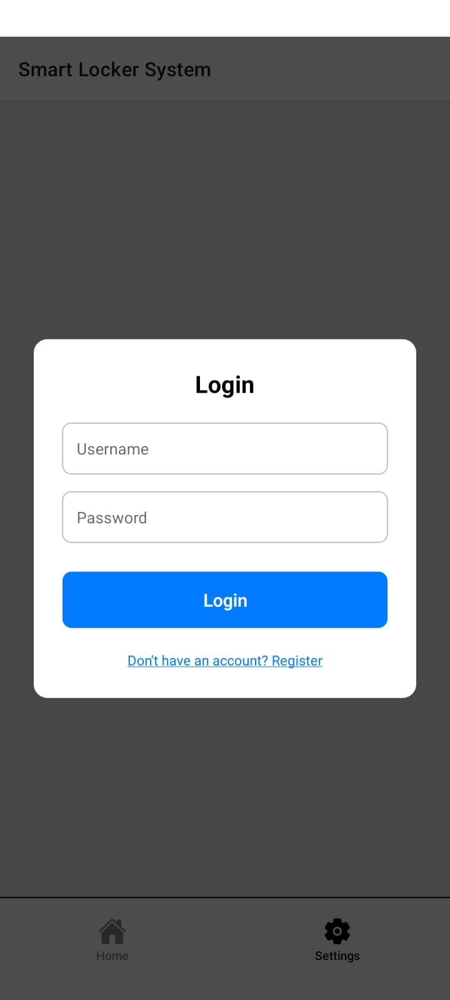
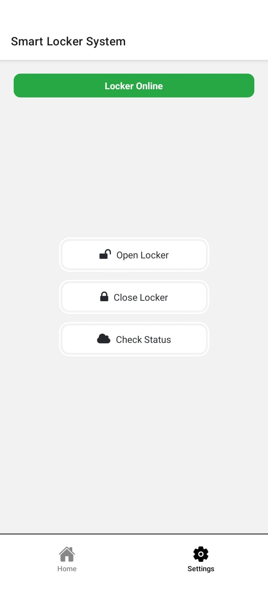
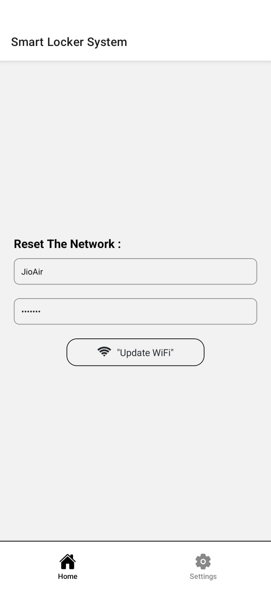

# ESP32 Smart Locker System

An IoT-enabled smart locker system featuring secure, remote-controlled access and real-time status monitoring using an ESP32 and a React Native mobile application.

## Table of Contents

- [Features](#features)
- [Project Structure](#project-structure)
- [Getting Started](#getting-started)
- [ESP32 Firmware Setup](#esp32-firmware-setup)
- [Mobile App Setup](#mobile-app-setup)
- [Contributing](#contributing)
- [License](#license)
- [Demo](#demo)

## Features

- Remote locker open/close through mobile app  
- Real-time status monitoring (locker open/closed, content presence)  
- Secure user authentication in app  
- Persistent Wi-Fi credential storage and update from app  
- Visual (LEDs) and audio (buzzer) feedback  

## Project Structure


```bash 
smart-locker-system/
├── esp32-firmware/ # ESP32 Arduino code and hardware docs
├── mobile-app/ # React Native app source code
├── docs/ # Project report, PPT, screenshots
├── LICENSE
└── README.md
``` 


## Getting Started

### Prerequisites

- ESP32 development board (NodeMCU ESP32 recommended)  
- Node.js & npm (for React Native app)  
- Android Studio / Xcode (for app testing)  
- Arduino IDE / VS Code (for firmware)  

## ESP32 Firmware Setup

1. Go to `esp32-firmware/`.  
2. Open the `.ino` file in Arduino IDE.  
3. Modify Wi-Fi credentials in the source code or use the mobile app Wi-Fi update feature.  
4. Connect your ESP32 board, select the correct port, and upload the sketch.  
5. Hardware schematic/images can be found in `hardware_schematics/`.  

## Mobile App Setup

1. Go to `mobile-app/`.  
2. Run `npm install` or `yarn install` to get dependencies.  
3. Adjust `ESP32_IP` in the code to your ESP32's local IP address.  
4. Use `npm start` to run the app with Expo, or build using React Native CLI.  
5. App screens:  
   - Login/registration  
   - Locker control (open, close, status)  
   - Wi-Fi credentials update  

## Contributing

Pull requests are welcome. For major changes, please open an issue first to discuss what you would like to change.

## License

This project is licensed under the MIT License.

## Demo

Showcasing app UI screens:

  
  
  



